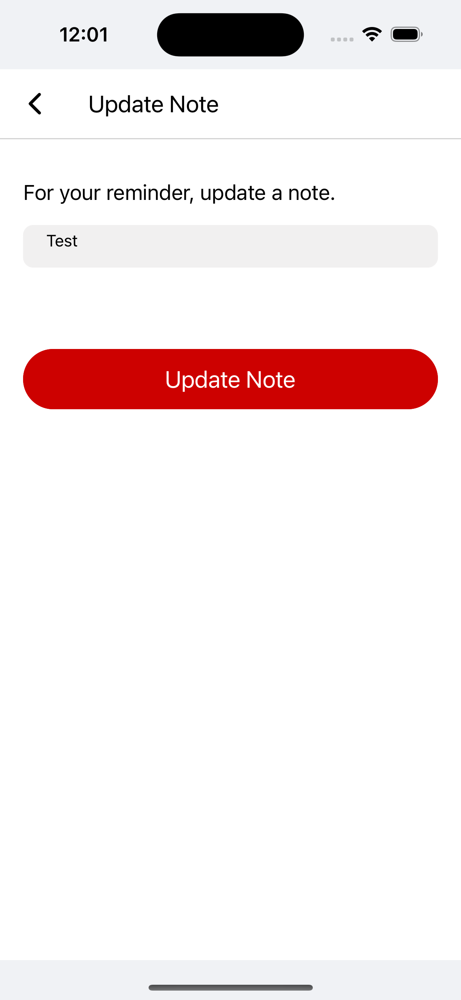

# Todo App

>**Note**: Users can create new notes for the todo app by entering text in a text input field.

## Step 1: Install Package

First, you will need to clone form github: https://github.com/lamsalbishal/OutCodeTodoApp.git
Second, Go To Project Folder
Third, Install Package by cmd yarn

## Step 2: For Android

 To Run App react-native run-android 

## Step 3: For IOS

 Go To Iso Folder Pod Install
 To Run App react-native run-ios 

## Step 4: Start your Application

After starting a project, you'll make notes, edit them, delete them, and make sure they're complete as well.

## For Testing
 
 Run yarn test

## App Screenshots :

  
  
  
  
  

  
  
  
  
 

